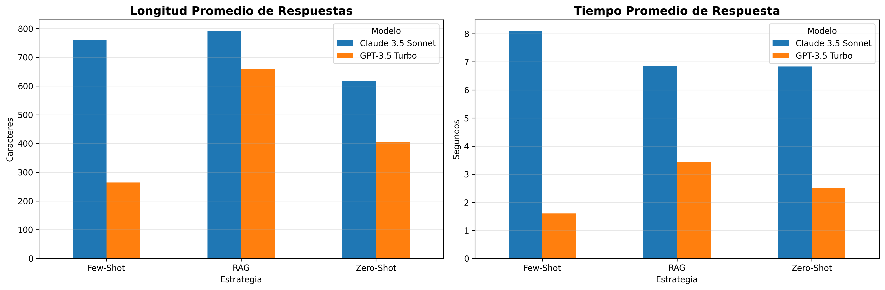

# 🇵🇾 Chatbot RAG para Guaraní (Avañe'ẽ)

Un asistente inteligente para aprender y consultar sobre el idioma guaraní, utilizando **RAG (Retrieval-Augmented Generation)** y comparando el rendimiento de diferentes modelos de lenguaje.

---

## 📖 ¿Qué es este Chatbot?

Este chatbot está diseñado para responder preguntas sobre el **idioma guaraní** (avañe'ẽ), una lengua indígena hablada por más de 6 millones de personas en Paraguay, Argentina, Brasil y Bolivia.

El sistema utiliza documentos reales de gramática guaraní para proporcionar respuestas precisas sobre:
- Vocabulario y traducciones
- Gramática y estructura de oraciones
- Pronombres y conjugaciones verbales
- Pronunciación y fonología

### ¿Por qué Guaraní?

El guaraní es un **idioma de bajo recursos** en inteligencia artificial, lo que significa que los modelos de lenguaje tienen conocimiento limitado sobre él. Este proyecto investiga si RAG puede mejorar las respuestas de los LLMs para estos idiomas.

---

## 🛠️ Metodología de Entrenamiento

### 1. Construcción del Vector Store

El proceso para crear la base de conocimiento fue:

```
PDF Gramática Guaraní → Extracción de texto → Chunking → Embeddings → FAISS Vector Store
```

| Parámetro | Valor |
|-----------|-------|
| Fuente de datos | GramaticaGuarani.pdf |
| Modelo de embeddings | `sentence-transformers/paraphrase-multilingual-mpnet-base-v2` |
| Tamaño de chunk | 1000 caracteres |
| Overlap entre chunks | 200 caracteres |
| Total de chunks generados | 427 documentos |
| Vector Store | FAISS |
| Documentos recuperados (k) | 3 |

### 2. Estrategias Evaluadas

Se compararon tres estrategias de prompting:

| Estrategia | Descripción |
|------------|-------------|
| **Zero-shot** | El modelo responde solo con su conocimiento previo |
| **Few-shot** | El modelo recibe 3 ejemplos antes de responder |
| **RAG** | El modelo recibe documentos relevantes de la gramática guaraní |

### 3. Modelos Comparados

| Modelo | Proveedor | Características |
|--------|-----------|-----------------|
| **GPT-3.5 Turbo** | OpenAI | Rápido, económico |
| **Claude 3.5 Sonnet** | Anthropic | Más potente, respuestas detalladas |

---

## 📊 Resultados de la Evaluación

### Gráfico Comparativo



### Métricas por Estrategia

| Modelo | Estrategia | Tiempo Promedio | Longitud Respuesta |
|--------|------------|-----------------|-------------------|
| GPT-3.5 Turbo | Zero-shot | 2.39s | ~800 caracteres |
| GPT-3.5 Turbo | Few-shot | 1.60s | ~650 caracteres |
| GPT-3.5 Turbo | RAG | 3.43s | ~950 caracteres |
| Claude 3.5 Sonnet | Zero-shot | 6.33s | ~1200 caracteres |
| Claude 3.5 Sonnet | Few-shot | 8.09s | ~1400 caracteres |
| Claude 3.5 Sonnet | RAG | 6.85s | ~1100 caracteres |

### Ejemplo: ¿Cómo se forma el plural en guaraní?

**Sin RAG (GPT-3.5)** ❌
> El plural se forma agregando "-rõ" al final de la palabra.

*Incorrecto: La partícula es "kuéra" o "nguéra", no "-rõ".*

**Con RAG (GPT-3.5)** ✅
> El plural se forma con la partícula "kuéra" o "nguéra". El guaraní tiene plural genérico, no siempre es necesario marcar el plural.

*Correcto y con información adicional importante.*

---

## 📈 Conclusiones

### 1. RAG es esencial para idiomas de bajo recursos

- **Sin RAG**: Los modelos inventan reglas gramaticales incorrectas
- **Con RAG**: Las respuestas son verificables y precisas
- El RAG reduce drásticamente las "alucinaciones" de los modelos

### 2. Comparación de Modelos

| Aspecto | GPT-3.5 Turbo | Claude 3.5 Sonnet |
|---------|---------------|-------------------|
| Velocidad | ⭐⭐⭐⭐⭐ | ⭐⭐⭐ |
| Costo | ⭐⭐⭐⭐⭐ | ⭐⭐⭐ |
| Calidad sin RAG | ⭐⭐ | ⭐⭐⭐ |
| Calidad con RAG | ⭐⭐⭐⭐ | ⭐⭐⭐⭐⭐ |

### 3. Recomendación Final

- **Para producción económica**: GPT-3.5 + RAG
- **Para máxima calidad**: Claude 3.5 + RAG
- **Nunca usar sin RAG** para idiomas de bajo recursos

---

## 🚀 Cómo Ejecutar el Chatbot

### Con Docker (Recomendado)

```bash
git clone https://github.com/JuanAquino22/project_ia.git
cd project_ia

# Configurar API Key
echo "OPENROUTER_API_KEY=tu_api_key" > .env

# Ejecutar
docker compose up --build
```

Accede a: `http://localhost:7860`

### Sin Docker

```bash
pip install -r requirements.txt
python app.py
```

---

## 🛠️ Tecnologías Utilizadas

- **LangChain** - Framework para RAG
- **FAISS** - Vector store para búsqueda de similitud
- **HuggingFace** - Modelo de embeddings multilingüe
- **OpenRouter** - API unificada para LLMs
- **Gradio** - Interfaz web
- **Docker** - Containerización

---

## 👥 Autor

**Juan Aquino** - [@JuanAquino22](https://github.com/JuanAquino22)

---

> ⚠️ **Nota**: Este proyecto es de carácter educativo y de investigación. Las respuestas del chatbot son generadas por IA y no deben considerarse como referencia oficial del idioma guaraní.